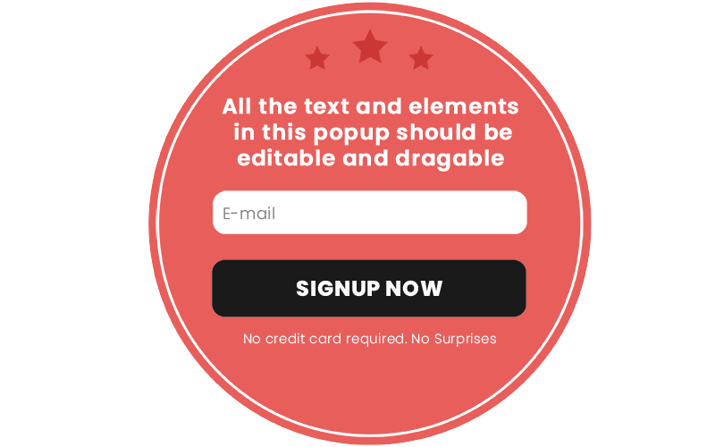

# Poptin Editor 

## Project description
This is a frontend clone of the customisable Poptin Editor which can be used to create popups.

## Table of Contents
- [Project Setup](#project-setup)
- [Compiles and hot-reloads for development](#compiles-and-hot-reloads-for-development)
- [Compiles and minifies for production](#compiles-and-minifies-for-production)

## Built with
- [Vue](https://vuejs.org/) - An approachable, performant and versatile framework for building web user interfaces.
- [Typescript](https://www.typescriptlang.org/) - JavaScript with syntax for types
- [TailwindCSS](https://tailwindcss.com/) - A utility first CSS framework

## Project setup
```
npm install
```

### Compiles and hot-reloads for development
```
npm run dev
```

### Compiles and minifies for production
```
npm run build
```

## Visuals


### Contributors
- Chinemelu Anthony Nwosu


